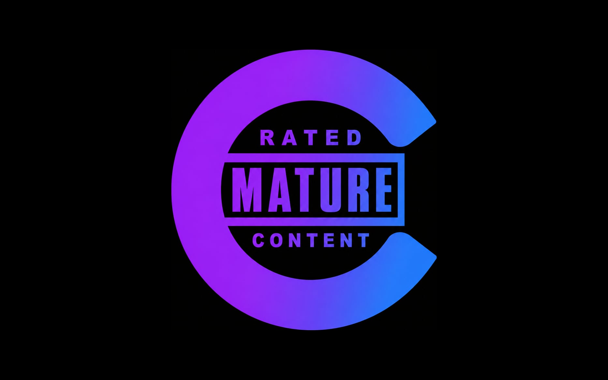

<div align="center">
  

# Chaperone

**Automatic parental ratings for your entire Jellyfin library — music, movies, shows, and anime.**

</div>

---

Jellyfin's parental controls are only as good as the `OfficialRating` metadata on your items. But a lot of content arrives with **no rating at all** — especially music pulled in by the *arr stack, and imports that never matched a certification. Anything unrated slips straight past age restrictions.

**Chaperone fills in the blanks.** It looks up missing ratings from public data sources and writes them back to Jellyfin's own rating field, so the parental controls you already configured actually work across everything.

## What it does

| Content | Source | How |
| --- | --- | --- |
| **Music** | [Deezer](https://www.deezer.com/) | Matches each track (artist + title) and reads its explicit-lyrics flag. Falls back to an **ISRC** lookup via [MusicBrainz](https://musicbrainz.org/) for exact matching when a fuzzy search is ambiguous. |
| **Movies** | [TMDb](https://www.themoviedb.org/) | Reads release-date certifications across **all regions** and picks a rating. |
| **Shows** | [TMDb](https://www.themoviedb.org/) | Reads content-rating certifications across all regions. |
| **Anime** | [MyAnimeList](https://myanimelist.net/) (via [Jikan](https://jikan.moe/)) | Fallback resolver for anime that TMDb doesn't cover well. |

Ratings are written using Jellyfin's standard scale (`TV-G`, `TV-PG`, `TV-14`, `TV-MA`, and the MPAA equivalents), which interoperate numerically — so a kid restricted to `TV-14` is correctly blocked from `TV-MA` and `R` content regardless of which scale a given item uses.

### Explicit music → a real rating

Explicit tracks get **`TV-MA`** by default and clean tracks get **`TV-G`** (both configurable). That turns Deezer's explicit flag into something Jellyfin's parental controls can actually enforce.

## How it works

- **Automatic on import.** Chaperone registers metadata providers for audio, movies, and series, so new content gets rated as it's added to the library.
- **Albums are rated too.** Each music album is rated from its tracks using the *least restrictive* rating present, so parental controls don't hide the whole album (or its artist) just because the container has no rating of its own. A clean album stays browsable while an explicit track inside it remains individually blocked. Artists need no rating — Jellyfin shows an artist automatically once it has visible content underneath.
- **Three fallbacks so tracks aren't left unrated.** For music the plugin tries, in order: (1) a fuzzy Deezer search on artist + title; (2) an exact **ISRC** lookup via MusicBrainz for anything ambiguous; and (3) if both miss — some recordings simply have no ISRC in MusicBrainz, or none on Deezer — the track **inherits its album's rating**. If even that can't help (the whole album is unidentifiable), the track is labeled **`Unrated`** (configurable) rather than left blank — an honest fill, so there's never a gap.

### The artist workaround

Turning on Jellyfin's **"Block items with no or unrecognized rating information"** is what actually hides unrated/unidentified music from restricted users — but Jellyfin then also blocks the **artist folder** itself unless it carries a recognized rating, which breaks browsing music by artist. Jellyfin gives no way to exempt artist containers from that block, so Chaperone stamps **every artist `TV-G`** (the *Keep artists browsable* option, on by default). This is a deliberate workaround, **not** a content judgement of the artist — the real filtering still happens on the albums and tracks inside. If you'd rather rate artists yourself, turn the option off.
- **Non-destructive by default.** It only fills in a rating when the field is **blank**. Existing ratings are left alone unless you turn on *Overwrite existing ratings*.
- **Manual full-library scan.** A button on the plugin's config page (and a matching **Dashboard → Scheduled Tasks** entry, *Chaperone Library Scan*) runs a one-off pass over everything already in your library to backfill missing ratings.
- **Automatic index refresh.** Jellyfin only recomputes a folder's effective parental rating (what restricted users are actually filtered on) during a *library scan* — not when items are edited. So after its own scan makes changes, Chaperone **queues a Jellyfin library scan automatically**, so the new album/artist/track ratings take effect for restricted users without you having to run *Scan Media Library* by hand.

## Requirements

- **Jellyfin 10.11.x** (built against `10.11.11`).
- Outbound internet access to Deezer, MusicBrainz, TMDb, and Jikan. All are used with **free, no-auth public endpoints**; MusicBrainz and Jikan are politely rate-limited by the plugin.
- **No API keys required.** TMDb access uses Jellyfin's public key out of the box; you can supply your own TMDb v3 key in settings if you prefer.

## Installation

### Add the plugin repository (recommended)

1. In Jellyfin, go to **Dashboard → Plugins → Repositories** and add a new repository with this URL:
   ```
   https://raw.githubusercontent.com/OMGrant/jellyfin-plugin-chaperone/main/manifest.json
   ```
2. Open the **Catalog** tab, find **Chaperone** under *Metadata*, and install it.
3. Restart Jellyfin. Updates then show up in the catalog automatically.

### From a release (manual)

1. Download `chaperone_x.y.z.zip` from the [Releases](https://github.com/OMGrant/jellyfin-plugin-chaperone/releases) page.
2. Extract it into a new folder under your Jellyfin `plugins` directory (e.g. `/var/lib/jellyfin/plugins/Chaperone_1.0.0.0/`).
3. Restart Jellyfin. Chaperone appears under **Dashboard → Plugins**.

### Build it yourself

The build only needs the .NET 9 SDK:

```bash
dotnet publish -c Release -o ./publish
```

Then copy `publish/Jellyfin.Plugin.Chaperone.dll`, `meta.json`, and `thumb.png` together into a folder under your Jellyfin `plugins` directory and restart.

> No local SDK? Build in a container:
> ```bash
> podman run --rm -v "$PWD":/src:ro,z mcr.microsoft.com/dotnet/sdk:9.0 \
>   bash -c 'cp -r /src /b && cd /b && dotnet publish -c Release -o /b/out && cat /b/out/Jellyfin.Plugin.Chaperone.dll' > Jellyfin.Plugin.Chaperone.dll
> ```

## Configuration

Open **Dashboard → Plugins → Chaperone**.

| Setting | Default | What it does |
| --- | --- | --- |
| **Enabled** | on | Master switch. |
| **Explicit music rating** | `TV-MA` | Rating applied to explicit tracks. |
| **Clean music rating** | `TV-G` | Rating applied to clean tracks. |
| **TMDb API key (v3)** | Jellyfin's public key | Used for movie/show certifications; replace with your own if you like. |
| **Rate music / movies / shows / anime** | all on | Toggle each content type independently. |
| **Overwrite existing ratings** | off | When on, replaces ratings that are already set instead of only filling blanks. |

Use **Run full library scan** to backfill your existing library at any time.

## Privacy

Chaperone only sends the minimum needed to identify an item — a track's artist/title (or ISRC), or a movie/show/anime's title and provider IDs — to the public metadata services listed above. It stores nothing externally and adds no telemetry.

## A note on the code

> Yes, this plugin is vibe coded. No, I don't care to hear your opinion about it.
> We all cried when Tony Stark died — and he vibe coded 99% of his work too.

## License

[MIT](LICENSE) © Grant Garrison

Not affiliated with Jellyfin, Deezer, MusicBrainz, TMDb, or MyAnimeList. This product uses the TMDb API but is not endorsed or certified by TMDb.
